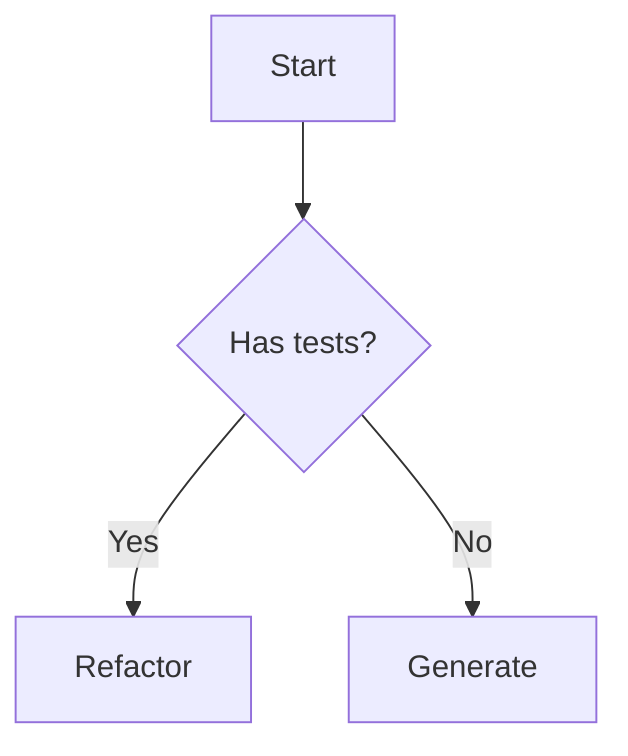

# Claude Code Plugins — Best Practices Guide

This document captures best practices for writing Claude Code plugins, learned from official documentation and the feature-dev example.

## Plugin Structure

```
my-plugin/
├── .claude-plugin/
│   └── plugin.json              # Required: manifest
├── commands/                    # Slash commands (*.md)
│   └── my-command.md
├── agents/                      # Subagents (*.md)
│   └── my-agent.md
├── skills/                      # Model-invoked skills (optional)
│   └── my-skill/
│       └── SKILL.md
├── hooks/                       # Event handlers (optional)
│   └── hooks.json
└── README.md                    # Usage documentation
```

## plugin.json Manifest

```json
{
  "name": "my-plugin", // Required: kebab-case identifier
  "version": "1.0.0", // Recommended: semver
  "description": "Brief description",
  "author": {
    "name": "Author Name",
    "email": "email@example.com"
  },
  "commands": ["./commands/*.md"],
  "agents": ["./agents/*.md"]
}
```

**Key points:**

- All paths must start with `./` (relative to plugin root)
- Use glob patterns for commands and agents
- Version follows semantic versioning

## Slash Commands

Commands are Markdown files with YAML frontmatter:

```markdown
---
description: One-liner shown in /help
argument-hint: <required_arg> [optional_arg]
model: sonnet # Optional: sonnet, opus, haiku
allowed-tools: Read, Grep, Glob # Optional: restrict tools
---

# Command Title

Detailed instructions for Claude on how to execute this command.
```

**Best practices:**

- Keep description under 80 characters
- Use `argument-hint` to guide users
- Specify `allowed-tools` if command should be limited
- Structure instructions clearly with phases/steps

## Subagents

Agents are specialized AI assistants for specific tasks:

```markdown
---
name: my-agent
description: >
  Multi-line description explaining what this agent does
  and when Claude should delegate to it.
tools: Read, Grep, Glob, Bash, TodoWrite
model: sonnet
---

You are a specialized agent for [specific purpose].

Your responsibilities:

1. First responsibility
2. Second responsibility

Your output format:

- Structure your response as...
```

**Best practices:**

- Descriptive name encourages automatic delegation
- List specific tools needed (avoid giving all tools)
- Clear output format instructions
- Model selection: haiku for simple, sonnet for complex

## Multi-Phase Workflows (feature-dev pattern)

For complex tasks, use 7-phase workflow:

### Phase 1: Discovery

Clarify requirements before doing anything.

### Phase 2: Exploration

Launch parallel agents to understand codebase.

### Phase 3: Clarifying Questions

Identify and resolve ambiguities.

### Phase 4: Architecture/Design

Multiple approaches, recommend one.

### Phase 5: Implementation

Execute with user approval.

### Phase 6: Review

Parallel review agents check quality.

### Phase 7: Summary

Document results and next steps.

**Key patterns:**

- Always ask before major actions
- Run independent agents in parallel
- Read identified files before implementation
- User approval gates between phases

## Serena MCP Integration

For semantic code analysis, use Serena MCP tools:

| Tool                       | Purpose                          |
| -------------------------- | -------------------------------- |
| `find_symbol`              | Locate classes, methods, modules |
| `get_symbols_overview`     | Top-level symbols in a file      |
| `find_referencing_symbols` | Find all usages                  |
| `search_for_pattern`       | Regex search in codebase         |

**When to use Serena vs grep:**

- Serena: method boundaries, semantic understanding
- Grep: text patterns, non-code files

## Agent Communication

Agents don't share context directly. Communication mechanisms:

| Scenario                    | Mechanism      | Rationale                           |
| --------------------------- | -------------- | ----------------------------------- |
| Single autonomous task      | Context        | Agent receives everything upfront   |
| Parallel independent agents | Context        | No dependencies between agents      |
| Sequential pipeline         | Metadata files | Each agent reads/writes artifacts   |
| Long-running/resumable      | Files + resume | Survives sessions                   |

**For pipelines (multi-agent workflows):** Use metadata files. See Rule 17.
**For single tasks:** Pass data via prompt context.

## Error Handling

- Check prerequisites before starting
- Fail fast with clear error messages
- Offer remediation steps
- Don't proceed if critical requirements missing

## Testing Plugins

1. Create local marketplace:

```bash
mkdir dev-marketplace
cat > dev-marketplace/marketplace.json << 'EOF'
{
  "name": "local",
  "owner": "dev",
  "plugins": [{"name": "my-plugin", "path": "../my-plugin"}]
}
EOF
```

2. Install and test:

```
/plugin marketplace add ./dev-marketplace
/plugin install my-plugin@local
/my-command test-arg
```

3. Iterate:

```
/plugin uninstall my-plugin@local
# Make changes
/plugin install my-plugin@local
```

## Agent Requirements

Every agent must follow these rules:

### Rule 1: Size Limit

Main agent file **should be under 500 lines** (target: 300-400), but quality is more important than quantity.

Large specs cause cognitive overload and unpredictable behavior.

### Rule 2: Progressive Disclosure

Split large content into supporting files:

```
agents/
├── my-agent.md              # Main file (300-400 lines)
├── my-agent/
│   ├── conditional-algo.md  # Only loaded when trigger condition met
│   └── examples/            # Reference material (not loaded during execution)
```

**When Progressive Disclosure helps:**

- Content is **conditionally needed** (has clear trigger: "IF X then read file Y")
- Reference material not needed during execution (examples)

**When it does NOT help:**

- Content is **always needed** — inline it instead (no token savings)
- Loading later still adds to context (files accumulate, not replace)

**Good extraction:**

```markdown
### 5.5 Smart Naming (Conditional)

**IF single domain detected**: Read `my-agent/smart-naming.md`
**IF multiple domains**: Skip file, keep prefixes.
```

**Bad extraction:**

```markdown
### 5.1 Classification

**Load**: `my-agent/classification.md` # Always needed → should be inline
```

### Rule 3: TodoWrite Protocol (agents AND commands)

Both agents and commands must use TodoWrite to track progress.

**Why in agents too?** Even if todo isn't visible to user, it forces the model to follow a structured plan through Claude Code's internal mechanisms.

**TodoWrite Rules:**

1. **Create at start** — initial high-level phases
2. **Update dynamically** — expand with specifics when known (e.g., method names before analysis)
3. **Mark completed immediately** — don't batch completions
4. **One in_progress** at a time

**Hierarchy via naming convention** (TodoWrite doesn't support nesting):

```markdown
- [Phase 1] Discovery
- [Phase 2] Analysis
- [Phase 3] Output
```

**Dynamic expansion example** (before detailed work):

```markdown
- [Phase 1] Discovery ✓
- [Phase 2] Analysis ✓
- [3.1] Process method: create
- [3.2] Process method: update
- [3.3] Process method: destroy
- [Phase 4] Output
```

**Phase prefixes**: `[Phase N]` for major phases, `[N.M]` for steps within phase.

**Section placement in agents:**

TodoWrite protocol must be documented in a dedicated `## Execution Protocol` section:

- **Position**: After Input/Output sections, before Phase sections
- **Contains**: TodoWrite Rules + Example TodoWrite Evolution

```markdown
## Input

...

## Output

...

---

## Execution Protocol

### TodoWrite Rules

1. Create initial TodoWrite at start
2. Update dynamically before key phases
3. Mark completed immediately
4. One in_progress at a time

### Example TodoWrite Evolution

[Show initial → expanded states]

---

## Phase 1: ...
```

### Rule 4: YAML Frontmatter

Required fields with strict limits:

```yaml
---
name: my-agent # max 64 characters
description: "What it does. When to use it." # max 200 characters
tools: Read, Grep, Glob, TodoWrite
model: sonnet
---
```

### Rule 5: Description Quality

Description must specify **function AND triggers**:

```yaml
# bad — too vague
description: "Analyzes code"

# good — function + trigger
description: "Analyze RSpec tests for BDD compliance. Use when reviewing test files or planning test refactoring."
```

### Rule 6: Terminology

Know the difference:

| Type          | Purpose                      | Location                            |
| ------------- | ---------------------------- | ----------------------------------- |
| **Skill**     | Auto-activation capability   | `.claude/skills/name/SKILL.md`      |
| **Subagent**  | Explicit delegation via Task | `.claude/agents/name.md` or plugins |
| **CLAUDE.md** | Project-wide instructions    | `./CLAUDE.md`                       |

### Rule 7: AskUserQuestion for Decisions (First Shot Success)

At critical decision points, **ask the user** instead of deciding autonomously.

**Prohibited patterns:**

- ❌ `**When uncertain:** default to X`
- ❌ `**If unclear:** assume Y`
- ❌ `**Otherwise:** choose Z`

**Required pattern:**

- ✅ `**When uncertain:** use AskUserQuestion` with clear options

**Rationale:** "First shot success" — asking early avoids rework. Users prefer answering a question once over fixing wrong assumptions later.

**When to use AskUserQuestion:**

- Test level unclear (unit vs integration vs request)
- Multiple valid approaches exist
- Edge case handling ambiguous
- Performance vs readability trade-off

**Example in agent spec:**

```markdown
**When uncertain:** Use AskUserQuestion to clarify:

- "Option A" — description of option A
- "Option B" — description of option B
```

Don't make assumptions — ask early, avoid rework.

### Rule 8: Content Structure & Progressive Disclosure

**Main file contains:**

- What agent does (phases, workflow)
- When to load supporting files (CLEAR TRIGGERS)
- Short procedures (<30 lines)
- Critical logic that cannot be skipped

**Supporting files contain:**

- How to do complex operations (>50 lines)
- Conditional algorithms (only needed in specific cases)
- Alternative approaches (simple vs detailed)

**CRITICAL: Trigger Requirements**

Every reference to a supporting file MUST have a clear trigger condition.

❌ Bad:

- `**For details:** Read file.md`
- `**See also:** file.md`
- `Read file.md for more information`

✅ Good:

- `**IF [condition]:** Read file.md`
- `**WHEN [situation]:** Load algorithm from file.md`

Without clear trigger, agent behavior is unpredictable (always reads = wastes tokens, never reads = misses info).

**When to keep in main file:**

- Steps always executed together (merge into one section)
- Content always needed (no token savings from extraction)
- Critical logic that cannot be missed

**Test for valid extraction:** Can you write a clear IF/WHEN trigger? If no trigger exists, content should be inline or deleted.

### Rule 9: No ASCII Diagrams in Agent Specs

Agent and command files are instructions for Claude, not human documentation.
ASCII tables and diagrams consume 10x more tokens than equivalent text.

**Instead of:**

```
┌─────────────────────────────────┐
│ Phase 1: Discovery              │
│   - Get files                   │
│   - Classify                    │
└────────────────────┬────────────┘
                     │
                     ▼
┌────────────────────────────────┐
│ Phase 2: Analysis              │
└────────────────────────────────┘
```

**Use:**

```markdown
## Workflow (6 phases, sequential)

1. **Discovery** — get files, classify, get approval
2. **Analysis** — extract characteristics (parallel agents)
3. **Architecture** — design context hierarchy (parallel)
4. **Implementation** — generate specs (parallel)
5. **Review** — run tests, check compliance
6. **Summary** — report results
```

**Mermaid exception**: If flow has complex branching, Mermaid is acceptable:



**Where diagrams are fine:**

- README.md (human documentation)
- User-facing guides
- docs/ folder content

### Rule 10: Prerequisites at Command Level

Check prerequisites (tools, config, files) at **command level** before spawning agents.

**Rationale:**

- Commands spawn multiple agents in parallel
- Duplicate checks in each agent waste tokens and time
- If tool is available to command, it's available to agents

**Commands check (Prerequisites section):**

- External tools: Serena MCP, Git, RSpec, Ruby runtime
- Plugin config: `.claude/rspec-testing-config.yml` exists
- Environment: spec_helper, factories path, project structure

**Agents check (Input Requirements section):**

- Input data from orchestrator or previous agent
- Pipeline state markers: `automation.*_completed`
- Metadata file exists at expected path

**Don't check in agents:**

- ❌ External tool availability (command verified)
- ❌ Config file existence (command verified)
- ❌ Environment setup (command verified)

**Command structure:**

```markdown
## Prerequisites

Before starting, verify:

1. **Serena MCP** — `mcp__serena__get_current_config`
2. **Git repository** — `git rev-parse --git-dir`
3. **Plugin config** — `.claude/rspec-testing-config.yml` exists

If missing → error, suggest fix, stop.
```

**Agent structure:**

````markdown
## Input Requirements

Receives from orchestrator:

```yaml
slug: app_services_payment
```
````

**Resolution:**

1. Read plugin config for `metadata_path`
2. Build path: `{metadata_path}/rspec_metadata/{slug}.yml`
3. Read metadata file

**Verify before proceeding:**

- Metadata file exists
- `{previous_agent}_completed: true` in metadata

If missing → error, suggest running previous agent.

````

**Key distinction:**
- "Prerequisites" = external environment (verified once by command)
- "Input Requirements" = pipeline data (verified by each agent)

### Rule 11: Fail-Fast for Missing Requirements

If required tool, data, or input is missing, agent must **immediately stop** and report.

**Required behavior:**

1. Return structured error with clear message
2. Include suggestion for resolution
3. Never attempt workarounds

**Example:**

```yaml
status: error
error: "File not found: app/services/foo.rb"
suggestion: "Verify path is correct"
````

**Prohibited behaviors:**

- ❌ Silently skip missing data
- ❌ Try to infer missing information
- ❌ Continue with partial work
- ❌ Attempt to fix environment (install tools, create files)

**When to use AskUserQuestion:**

- Invalid/missing input from previous agent — let user decide to re-run, skip, or provide manually
- Ambiguous input (multiple interpretations possible)
- Optional parameter not specified

**When to return structured error (no Ask):**

- Missing required tools (environment issue)
- File not found (user provided wrong path)

### Rule 12: Status Contract

Agents communicate via structured output with status field:

| Status    | Meaning                         | Command Action            |
| --------- | ------------------------------- | ------------------------- |
| `success` | Work completed normally         | Continue pipeline         |
| `stop`    | Cannot proceed (valid decision) | Halt, show reason to user |
| `error`   | System/unexpected failure       | Halt, show error          |

**Stop vs Error:**

- `stop` = deliberate decision (e.g., code too complex for automation)
- `error` = unexpected failure (file not found, parse error)

**Stop example:**

```yaml
status: stop
reason: red_zone_new_code
details:
  loc: 420
  methods: 18
message: "Class too large for automated test generation"
suggestions:
  - Split into smaller classes
  - Extract concerns/modules
```

### Rule 13: Skip vs Error

Skipping is NOT an error. Skip when no applicable work exists.

**Skip**: `status: success` with `skipped: true`
**Error**: `status: error`

```yaml
status: success
skipped: true
skip_reason: "No public methods found in module"
```

**When to skip:**

- Factory agent finds no setup types needed
- No FactoryBot gem in project (factory-related work)
- File already processed in this session

**When to error:**

- Required input missing or malformed
- File not found
- Parse failure

### Rule 14: Scripts for Routine Operations

If operation is 99.9% algorithmic (deterministic, no AI judgment needed):

1. Create shell script in `plugins/<plugin>/scripts/`
2. Agent calls script via Bash, gets result
3. Agent doesn't need to know script internals — saves tokens

**Script conventions:**

- **Input**: stdin (for pipes) or arguments
- **Output**: JSON or NDJSON for structured data, plain text for simple lists
- **Exit codes**: 0=success, 1=error
- **Composable**: Works with pipes (`|`)

**Example: File discovery pipeline**

```bash
./scripts/get-changed-files.sh --branch \
  | ./scripts/filter-testable-files.sh \
  | ./scripts/check-spec-exists.sh
```

**What to script:**

- Git operations (diff, log, status)
- File filtering by pattern
- File existence checks
- Path transformations
- Parsing structured output (JSON, YAML)

**What NOT to script:**

- Anything requiring semantic code understanding
- Decisions based on code content
- Classification requiring AI judgment
- User-facing prompts

**Benefits:**

- Saves tokens (agent doesn't read/think about routine logic)
- Deterministic results (same input → same output)
- Faster execution (bash vs agent reasoning)
- Reusable across agents and commands
- Testable independently

### Rule 15: Agent Header Structure

Every agent must have these sections after frontmatter, in this order:

**1. Responsibility Boundary** (scope definition):

```markdown
## Responsibility Boundary

**Responsible for:**
- [scope items this agent handles]

**NOT responsible for:**
- [what this agent delegates to others]

**Contracts:**
- Input: [what it receives]
- Output: [what it produces]
```

**Guideline:** Describe inputs as requirements, not by naming other agents. Treat upstream data as preconditions (e.g., "methods[].method_mode is required").

**2. Overview** (quick reference):

```markdown
## Overview

[1-2 sentence summary of what the agent does]

Workflow:
1. [Phase 1 summary]
2. [Phase 2 summary]
```

**3. Input Requirements** (detailed input schema):

```markdown
## Input Requirements

Receives from metadata file `{metadata_path}/rspec_metadata/{slug}.yml`:

```yaml
field_name: type
required_field: value
```

**Prerequisite check:** `automation.{previous_agent}_completed: true`
```

**4. Output Contract** (response + metadata):

```markdown
## Output Contract

### Response

```yaml
status: success | error
message: "Human-readable summary"
```

Status and summary only. Do not include data written to metadata.

### Metadata Updates

Updates `{metadata_path}/rspec_metadata/{slug}.yml`:
- [fields written]
- `automation.{agent}_completed: true`
```

**Standard section order:**

1. Responsibility Boundary
2. Overview
3. Input Requirements
4. Output Contract
5. Execution Protocol
6. Phase sections (1-N)
7. Error Handling

**Reference implementations:** `discovery-agent.md`, `code-analyzer.md`, `isolation-decider.md`

### Rule 16: Writer/Reader Contract

For pipeline agents that communicate via shared data (files, metadata):

1. **Document who writes each field** — prevents duplicate writes
2. **Document who reads each field** — identifies unused fields
3. **Writers own the schema** — readers adapt to writer's format

**Example (metadata table):**

| Field               | Writer          | Reader(s)      | Purpose                    |
| ------------------- | --------------- | -------------- | -------------------------- |
| `mode`              | discovery-agent | code-analyzer  | new_code vs legacy_code    |
| `characteristics[]` | code-analyzer   | test-architect | conditional logic analysis |
| `automation.*`      | each agent      | next agent     | pipeline state             |

**Why:** Prevents coupling, makes data flow explicit, enables independent agent development.

**Location:** Document contracts in `docs/metadata-schema.md` (Field Reference table) and `docs/agent-communication.md` (Progressive Enrichment). Subagent specs under `plugins/rspec-testing/agents/` must not link to these docs (see Rule 19).

### Rule 17: Subagent Data Flow (Metadata-First)

**Project standard:** All subagents communicate via metadata files, not through orchestrator context.

**1. Subagents communicate via metadata files**

- First agent in pipeline creates metadata file with all data
- Subsequent agents receive only identifier (slug) and read from file
- Each agent enriches the same file (progressive enrichment pattern)

**Rationale:**

- Orchestrator stays minimal (no context bloat)
- Enables parallel agent execution (all read from same source)
- Provides persistence across sessions
- Makes debugging easier (inspect file state)
- Separates orchestration logic from data transformation

**2. Subagents return orchestration-only data to commands**

| Return for | Content                                  |
| ---------- | ---------------------------------------- |
| Success    | `status: success`, brief summary, counts |
| Stop       | `status: stop`, reason, suggestions      |
| Error      | `status: error`, error message           |

Do NOT return:

- Full analysis results (write to metadata file instead)
- Data meant for next agent (write to metadata file instead)
- Debug information (write to metadata file or logs)

**3. Commands orchestrate, don't relay**

Commands should:

- ✅ Check agent status and decide next step
- ✅ Pass identifier (slug) to locate metadata
- ✅ Aggregate final results for user

Commands should NOT:

- ❌ Pass full agent output to next agent
- ❌ Transform or filter data between agents
- ❌ Hold pipeline state in context

**Example (correct pattern):**

```markdown
# In command:
Task(discovery-agent, {
  discovery_mode: "branch"
})
# Returns: status, method_waves (for orchestration), creates metadata files

Task(code-analyzer, {
  slug: "app_models_payment"  # Agent reads all data from file
})
# Returns: status only, writes to metadata file

Task(test-architect, {
  slug: "app_models_payment"  # Agent reads all data from file
})
# Returns: status, spec_file path, writes to metadata file
```

**Note:** This is a project-wide standard that differs from default Claude Code patterns (where orchestrator mediates all communication). The metadata-first approach better suits this project's pipeline architecture.

**4. Agent Output Contract structure**

Every agent must document output in two explicit sections:

**Response** (agent's return value):

```yaml
status: success | stop | error
message: "Human-readable summary"
```

Status and summary only. Do not include data written to metadata.

**Metadata Updates** (in `{metadata_path}/rspec_metadata/{slug}.yml`):

- Full analysis results
- Data for downstream agents
- `automation.{agent}_completed: true` marker

**Reference implementations:** See `isolation-decider.md` and `discovery-agent.md` for correct Output Contract structure.

### Rule 18: Input Abstraction (What, Not Who)

Agents document WHAT they receive, not WHO produces it.

**Do:**

```markdown
## Input Requirements

Receives (via metadata file `{slug}.yml`):
- `source_file` — path to Ruby file
- `methods[]` — list of methods to analyze
```

**Don't:**

```markdown
## Input Requirements

Receives from discovery-agent:  # ← coupling to specific agent
- `source_file` — path to Ruby file
```

**Rationale:**

- Agents are interchangeable tools
- Input contract is about data shape, not data source
- Reduces documentation coupling
- Enables pipeline reorganization without doc updates

**Exception:** "NOT responsible for" section MAY reference other agents to clarify scope boundaries.

**Slug resolution:** See `agents/shared/slug-resolution.md` for the standard algorithm.

### Rule 19: Subagent Reference Boundaries

This rule applies to the **content of agent spec files** under `plugins/rspec-testing/agents/`.

Subagents under `plugins/rspec-testing/agents/` MUST NOT reference or depend on anything outside the `agents/` tree, except:

- `plugins/rspec-testing/scripts/` (allowed)
- `.claude/rspec-testing-config.yml` (allowed)
- Metadata files at `{metadata_path}/rspec_metadata/{slug}.yml` (allowed)

This keeps subagents portable, prevents documentation coupling, and avoids “follow links” behavior that breaks orchestration.

**Allowed (inside agent files):**

- Referencing other agent subfiles via relative paths within `agents/`:
  - `shared/slug-resolution.md`
  - `code-analyzer/output-schema.md`
  - `isolation-decider/rails-heuristics.md`
- Reading config from `.claude/rspec-testing-config.yml`
- Reading/writing metadata files: `{metadata_path}/rspec_metadata/{slug}.yml`
- Calling scripts under `plugins/rspec-testing/scripts/` (see Rule 20)

**Not allowed (inside agent files):**

- References to `plugins/rspec-testing/docs/*` or repository-wide `docs/*`
- References to command docs under `plugins/rspec-testing/commands/*`
- Absolute paths (e.g., `/home/...`) for repo-local resources

### Rule 20: Relative Paths Within `rspec-testing/`

When an agent needs to reference something inside the `plugins/rspec-testing/` tree, it MUST use a path **relative to the current agent file**.

Examples (from files in `plugins/rspec-testing/agents/`):

- Scripts: `../scripts/spec_structure_generator.rb`
- Scripts (shell): `../scripts/get-changed-files-with-status.sh`

---

## Common Pitfalls

| Pitfall                | Solution                                         |
| ---------------------- | ------------------------------------------------ |
| Giant agent specs      | Keep under 400 lines, split into multiple agents |
| No prerequisites check | Always verify tools/files exist before starting  |
| Silent failures        | Report errors clearly, suggest fixes             |
| Over-automation        | Ask user at decision points                      |
| Tool overload          | Give agents only tools they need                 |

---

_This guide will be updated as we learn more from implementing rspec-testing plugin._
