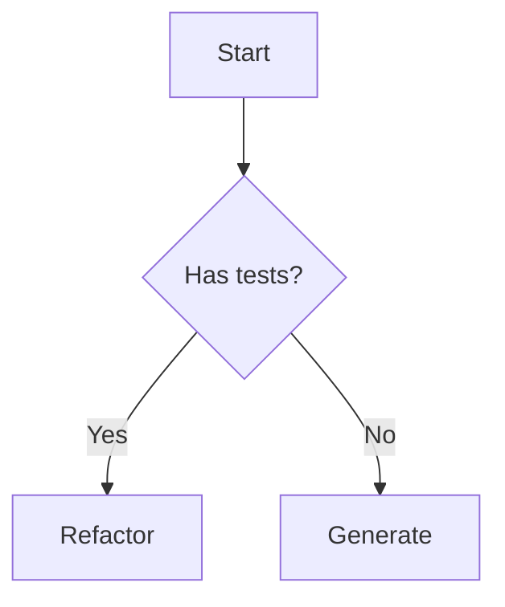

# Claude Code Plugins — Best Practices Guide

This document captures best practices for writing Claude Code plugins, learned from official documentation and the feature-dev example.

## Plugin Structure

```
my-plugin/
├── .claude-plugin/
│   └── plugin.json              # Required: manifest
├── commands/                    # Slash commands (*.md)
│   └── my-command.md
├── agents/                      # Subagents (*.md)
│   └── my-agent.md
├── skills/                      # Model-invoked skills (optional)
│   └── my-skill/
│       └── SKILL.md
├── hooks/                       # Event handlers (optional)
│   └── hooks.json
└── README.md                    # Usage documentation
```

## plugin.json Manifest

```json
{
  "name": "my-plugin", // Required: kebab-case identifier
  "version": "1.0.0", // Recommended: semver
  "description": "Brief description",
  "author": {
    "name": "Author Name",
    "email": "email@example.com"
  },
  "commands": ["./commands/*.md"],
  "agents": ["./agents/*.md"]
}
```

**Key points:**

- All paths must start with `./` (relative to plugin root)
- Use glob patterns for commands and agents
- Version follows semantic versioning

## Slash Commands

Commands are Markdown files with YAML frontmatter:

```markdown
---
description: One-liner shown in /help
argument-hint: <required_arg> [optional_arg]
model: sonnet # Optional: sonnet, opus, haiku
allowed-tools: Read, Grep, Glob # Optional: restrict tools
---

# Command Title

Detailed instructions for Claude on how to execute this command.
```

**Best practices:**

- Keep description under 80 characters
- Use `argument-hint` to guide users
- Specify `allowed-tools` if command should be limited
- Structure instructions clearly with phases/steps

## Subagents

Agents are specialized AI assistants for specific tasks:

```markdown
---
name: my-agent
description: >
  Multi-line description explaining what this agent does
  and when Claude should delegate to it.
tools: Read, Grep, Glob, Bash
model: sonnet
---

You are a specialized agent for [specific purpose].

Your responsibilities:

1. First responsibility
2. Second responsibility

Your output format:

- Structure your response as...
```

**Best practices:**

- Descriptive name encourages automatic delegation
- List specific tools needed (avoid giving all tools)
- Clear output format instructions
- Model selection: haiku for simple, sonnet for complex

## Multi-Phase Workflows (feature-dev pattern)

For complex tasks, use 7-phase workflow:

### Phase 1: Discovery

Clarify requirements before doing anything.

### Phase 2: Exploration

Launch parallel agents to understand codebase.

### Phase 3: Clarifying Questions

Identify and resolve ambiguities.

### Phase 4: Architecture/Design

Multiple approaches, recommend one.

### Phase 5: Implementation

Execute with user approval.

### Phase 6: Review

Parallel review agents check quality.

### Phase 7: Summary

Document results and next steps.

**Key patterns:**

- Always ask before major actions
- Run independent agents in parallel
- Read identified files before implementation
- User approval gates between phases

## Serena MCP Integration

For semantic code analysis, use Serena MCP tools:

| Tool                       | Purpose                          |
| -------------------------- | -------------------------------- |
| `find_symbol`              | Locate classes, methods, modules |
| `get_symbols_overview`     | Top-level symbols in a file      |
| `find_referencing_symbols` | Find all usages                  |
| `search_for_pattern`       | Regex search in codebase         |

**When to use Serena vs grep:**

- Serena: method boundaries, semantic understanding
- Grep: text patterns, non-code files

## Agent Communication

Agents don't share context directly. Options:

1. **Conversation context** — later agents see earlier results
2. **File-based** — write intermediate results to temp files
3. **TodoWrite** — track progress across phases

**Recommended:** Keep state in conversation, avoid complex file protocols.

## Error Handling

- Check prerequisites before starting
- Fail fast with clear error messages
- Offer remediation steps
- Don't proceed if critical requirements missing

## Testing Plugins

1. Create local marketplace:

```bash
mkdir dev-marketplace
cat > dev-marketplace/marketplace.json << 'EOF'
{
  "name": "local",
  "owner": "dev",
  "plugins": [{"name": "my-plugin", "path": "../my-plugin"}]
}
EOF
```

2. Install and test:

```
/plugin marketplace add ./dev-marketplace
/plugin install my-plugin@local
/my-command test-arg
```

3. Iterate:

```
/plugin uninstall my-plugin@local
# Make changes
/plugin install my-plugin@local
```

## Agent Requirements

Every agent must follow these rules:

### Rule 1: Size Limit

Main agent file **must be under 500 lines** (target: 300-400).

Large specs cause cognitive overload and unpredictable behavior.

### Rule 2: Progressive Disclosure

Split large content into supporting files:

```
agents/
├── my-agent.md              # Main file (300-400 lines)
├── my-agent/
│   ├── decision-trees/      # Complex decision logic
│   ├── algorithms/          # Step-by-step procedures
│   └── examples/            # Extended examples
```

Load supporting files only when needed.

### Rule 3: TodoWrite First (agents AND commands)

Both agents and commands must create TodoWrite **before starting work**.

**Why in agents too?** Even if todo isn't visible to user, it forces the model to follow a structured plan through Claude Code's internal mechanisms.

**Hierarchy via naming convention** (TodoWrite doesn't support nesting):

```markdown
## Workflow / Execution Protocol

Before starting, create TodoWrite:

- [Phase 1] Discovery
- [1.1] Check prerequisites
- [1.2] Run scripts
- [Phase 2] Analysis
- [2.1] Get symbols overview
- [2.2] Extract characteristics
- [Phase 3] Output
- [3.1] Build structured result
```

**Phase prefixes**: `[Phase N]` for major phases, `[N.M]` for steps within phase.

Mark each step complete before proceeding. This is official Claude Code pattern (ReAct framework).

### Rule 4: YAML Frontmatter

Required fields with strict limits:

```yaml
---
name: my-agent # max 64 characters
description: "What it does. When to use it." # max 200 characters
tools: Read, Grep, Glob
model: sonnet
---
```

### Rule 5: Description Quality

Description must specify **function AND triggers**:

```yaml
# bad — too vague
description: "Analyzes code"

# good — function + trigger
description: "Analyze RSpec tests for BDD compliance. Use when reviewing test files or planning test refactoring."
```

### Rule 6: Terminology

Know the difference:

| Type          | Purpose                      | Location                            |
| ------------- | ---------------------------- | ----------------------------------- |
| **Skill**     | Auto-activation capability   | `.claude/skills/name/SKILL.md`      |
| **Subagent**  | Explicit delegation via Task | `.claude/agents/name.md` or plugins |
| **CLAUDE.md** | Project-wide instructions    | `./CLAUDE.md`                       |

### Rule 7: AskUserQuestion for Decisions

At critical decision points, **ask the user** instead of deciding autonomously:

```markdown
## Decision Points

When encountering these situations, use AskUserQuestion:

- Test level unclear (unit vs integration vs request)
- Multiple valid approaches exist
- Edge case handling ambiguous
- Performance vs readability trade-off
```

**Example in agent spec:**

```markdown
If test level is ambiguous, use AskUserQuestion:

- "Unit test" — test class in isolation with mocks
- "Integration test" — test with real dependencies
- "Request test" — test full HTTP cycle
```

Don't make assumptions — ask early, avoid rework.

### Rule 8: Main File vs Supporting Files

Know what goes where:

| В главном файле агента      | В algorithms/ и др.             |
| --------------------------- | ------------------------------- |
| **Что** делает агент (фазы) | **Как** делать сложную операцию |
| Общий workflow (5-10 шагов) | Детальный алгоритм (15+ шагов)  |
| Когда загружать доп. файлы  | Сам контент доп. файлов         |
| Всегда загружается          | Загружается по требованию       |

**Выносить в supporting files когда:**

- Алгоритм >50 строк детальных шагов
- Алгоритм нужен не всегда (только в сложных случаях)
- Есть несколько вариантов (простой vs детальный)

**Оставить в главном файле:**

- Основной workflow (всегда нужен)
- Короткие процедуры (<30 строк)
- Критичная логика которую нельзя пропустить

### Rule 9: No ASCII Diagrams in Agent Specs

Agent and command files are instructions for Claude, not human documentation.
ASCII tables and diagrams consume 10x more tokens than equivalent text.

**Instead of:**

```
┌─────────────────────────────────┐
│ Phase 1: Discovery              │
│   - Get files                   │
│   - Classify                    │
└────────────────────┬────────────┘
                     │
                     ▼
┌────────────────────────────────┐
│ Phase 2: Analysis              │
└────────────────────────────────┘
```

**Use:**

```markdown
## Workflow (6 phases, sequential)

1. **Discovery** — get files, classify, get approval
2. **Analysis** — extract characteristics (parallel agents)
3. **Architecture** — design context hierarchy (parallel)
4. **Implementation** — generate specs (parallel)
5. **Review** — run tests, check compliance
6. **Summary** — report results
```

**Mermaid exception**: If flow has complex branching, Mermaid is acceptable:



**Where diagrams are fine:**

- README.md (human documentation)
- User-facing guides
- docs/ folder content

### Rule 10: Prerequisites at Command Level

Check prerequisites (tools, config, files) at **command level** before spawning agents.

**Rationale:**

- Commands spawn multiple agents in parallel
- Duplicate checks in each agent waste tokens and time
- If tool is available to command, it's available to agents

**Command structure:**

```markdown
## Prerequisites Check

Before starting, verify:

1. **Required tool available** — check Serena MCP / RSpec / etc.
2. **Files exist** — verify paths are valid
3. **Environment ready** — check for spec_helper, factories, etc.

If prerequisites missing, inform user and stop.
```

**Agent structure:**

```markdown
## Input Requirements

You receive:

- Analysis from previous agent (code-analyzer output)
- Target file path

If input is missing or malformed, use AskUserQuestion.
```

**Don't duplicate tool checks in agents** — command verified them already.

### Rule 11: Fail-Fast for Missing Requirements

If required tool, data, or input is missing, agent must **immediately stop** and report.

**Required behavior:**

1. Return structured error with clear message
2. Include suggestion for resolution
3. Never attempt workarounds

**Example:**

```yaml
status: error
error: "File not found: app/services/foo.rb"
suggestion: "Verify path is correct"
```

**Prohibited behaviors:**

- ❌ Silently skip missing data
- ❌ Try to infer missing information
- ❌ Continue with partial work
- ❌ Attempt to fix environment (install tools, create files)

**When to use AskUserQuestion:**

- Invalid/missing input from previous agent — let user decide to re-run, skip, or provide manually
- Ambiguous input (multiple interpretations possible)
- Optional parameter not specified

**When to return structured error (no Ask):**

- Missing required tools (environment issue)
- File not found (user provided wrong path)

### Rule 12: Status Contract

Agents communicate via structured output with status field:

| Status | Meaning | Command Action |
|--------|---------|----------------|
| `success` | Work completed normally | Continue pipeline |
| `stop` | Cannot proceed (valid decision) | Halt, show reason to user |
| `error` | System/unexpected failure | Halt, show error |

**Stop vs Error:**

- `stop` = deliberate decision (e.g., code too complex for automation)
- `error` = unexpected failure (file not found, parse error)

**Stop example:**

```yaml
status: stop
reason: red_zone_new_code
details:
  loc: 420
  methods: 18
message: "Class too large for automated test generation"
suggestions:
  - Split into smaller classes
  - Extract concerns/modules
```

### Rule 13: Skip vs Error

Skipping is NOT an error. Skip when no applicable work exists.

**Skip**: `status: success` with `skipped: true`
**Error**: `status: error`

```yaml
status: success
skipped: true
skip_reason: "No public methods found in module"
```

**When to skip:**

- Factory agent finds no setup types needed
- No FactoryBot gem in project (factory-related work)
- File already processed in this session

**When to error:**

- Required input missing or malformed
- File not found
- Parse failure

### Rule 14: Scripts for Routine Operations

If operation is 99.9% algorithmic (deterministic, no AI judgment needed):

1. Create shell script in `plugins/<plugin>/scripts/`
2. Agent calls script via Bash, gets result
3. Agent doesn't need to know script internals — saves tokens

**Script conventions:**

- **Input**: stdin (for pipes) or arguments
- **Output**: JSON or NDJSON for structured data, plain text for simple lists
- **Exit codes**: 0=success, 1=error
- **Composable**: Works with pipes (`|`)

**Example: File discovery pipeline**

```bash
./scripts/get-changed-files.sh --branch \
  | ./scripts/filter-testable-files.sh \
  | ./scripts/check-spec-exists.sh
```

**What to script:**

- Git operations (diff, log, status)
- File filtering by pattern
- File existence checks
- Path transformations
- Parsing structured output (JSON, YAML)

**What NOT to script:**

- Anything requiring semantic code understanding
- Decisions based on code content
- Classification requiring AI judgment
- User-facing prompts

**Benefits:**

- Saves tokens (agent doesn't read/think about routine logic)
- Deterministic results (same input → same output)
- Faster execution (bash vs agent reasoning)
- Reusable across agents and commands
- Testable independently

---

## Common Pitfalls

| Pitfall                | Solution                                         |
| ---------------------- | ------------------------------------------------ |
| Giant agent specs      | Keep under 400 lines, split into multiple agents |
| No prerequisites check | Always verify tools/files exist before starting  |
| Silent failures        | Report errors clearly, suggest fixes             |
| Over-automation        | Ask user at decision points                      |
| Tool overload          | Give agents only tools they need                 |

---

_This guide will be updated as we learn more from implementing rspec-testing plugin._
