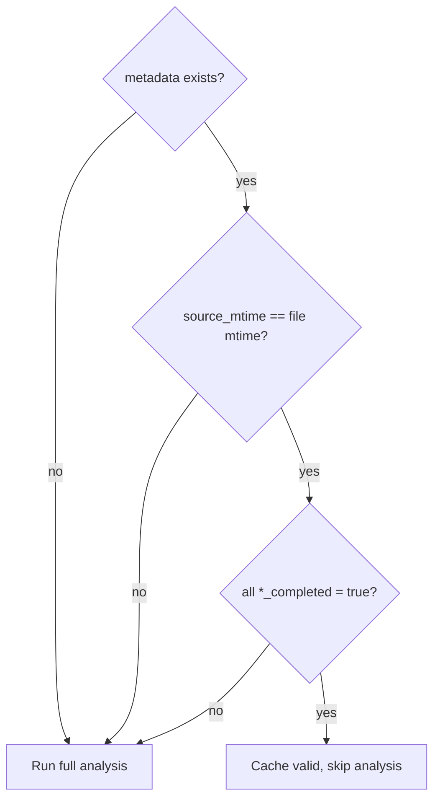
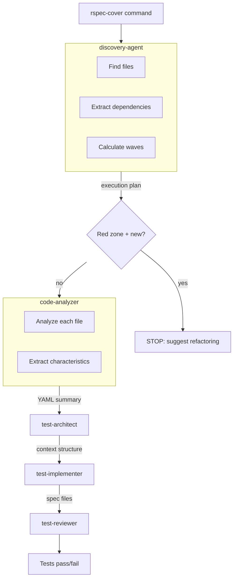

# Agent Communication Specification

Inter-agent communication patterns for rspec-testing plugin.

## Communication Mechanisms

| Scenario | Mechanism | Rationale |
|----------|-----------|-----------|
| Single autonomous task | Context (prompt) | Agent receives everything upfront |
| Parallel independent agents | Context (multiple Task calls) | No dependencies |
| Sequential pipeline | Files | Each agent reads/writes artifacts |
| Long-running/resumable | Files + resume | Survives sessions |

## Communication Channels

### 1. Agent Response (context-based)

Every agent returns YAML in final message:

```yaml
status: success | error | skip
data:
  # agent-specific structured output
error: "message"        # only if status: error
skip_reason: "message"  # only if status: skip
```

### 2. Metadata Files (file-based)

**Location**: `tmp/rspec_metadata/{slug}.yml`

**Slug convention**: Source path with `/` → `_`, no extension.
- `app/services/payment.rb` → `app_services_payment`

### 3. Code Artifacts

Standard RSpec locations: `spec/**/*_spec.rb`, `spec/factories/*.rb`

---

## Pipeline Protocol

### Agent Sequence


### Sequential Execution

Agents run **one at a time, in order**. Each depends on previous output.

### Completion Markers

Each agent writes to metadata file:

```yaml
automation:
  {agent}_completed: true
  {agent}_version: "1.0"
```

Agent names use snake_case: `code_analyzer_completed`, `test_architect_completed`.

### Prerequisite Check

Before starting, each agent MUST verify:

1. Previous agent's `{agent}_completed: true` exists
2. Required input files exist

If check fails → exit with error, pipeline stops.

### Fail-Fast

If any agent fails (returns `status: error`), entire pipeline stops. No retry logic.

### Skip Scenario

Agent MAY skip work if prerequisites met but work unnecessary:

```yaml
automation:
  {agent}_completed: true
  {agent}_skipped: true
  {agent}_skip_reason: "No testable methods found"
```

Skip = success. Next agent runs.

---

## YAML Schema

### Agent Output Contract

**discovery-agent** returns:

```yaml
status: success | stop | error
reason: (if stop) red_zone_new_code
message: (human-readable explanation)

waves:
  - wave: 0
    name: "Leaf classes"
    files:
      - path: app/services/payment.rb
        class_name: Payment
        mode: new_code | legacy_code
        complexity:
          zone: green | yellow | red
          loc: 85
          methods: 4
        dependencies: []
        spec_path: spec/services/payment_spec.rb

dependency_graph:
  nodes: [Payment, PaymentProcessor]
  edges: [{from: PaymentProcessor, to: Payment}]

summary:
  total_files: 2
  waves_count: 2
  by_zone: {green: 2, yellow: 0, red: 0}
```

**code-analyzer** returns:

```yaml
status: success
data:
  class_name: PaymentProcessor
  file_path: app/services/payment_processor.rb
  test_level: unit
  methods:
    - name: process
      type: instance
      characteristics:
        - name: payment_status
          type: enum
          values: [pending, completed, failed]
      dependencies: [PaymentGateway, User]
  factories:
    available:
      - name: payment
        traits: [pending, completed]
    missing: [Transaction]
```

**test-architect** returns:

```yaml
status: success
data:
  structure:
    describe: PaymentProcessor
    methods:
      - name: "#process"
        contexts:
          - name: "when payment valid"
            happy_path: true
            children:
              - name: "when status pending"
                examples: ["charges payment", "returns success"]
```

**test-implementer** returns:

```yaml
status: success
data:
  files_created:
    - path: spec/services/payment_processor_spec.rb
      examples_count: 8
    - path: spec/factories/payments.rb
      traits_added: [pending, completed]
```

**test-reviewer** returns:

```yaml
status: success
data:
  tests_passed: true
  violations: []
  # or
  tests_passed: false
  violations:
    - rule: 5
      description: "Missing edge case context"
      location: "spec/services/payment_spec.rb:45"
```

### Metadata File Schema

Full metadata file structure:

```yaml
# Written by discovery-agent
mode: new_code  # or legacy_code
complexity:
  zone: green  # green | yellow | red
  loc: 180
  methods: 8
dependencies: [PaymentGateway, User]  # within changed files
spec_path: spec/services/payment_processor_spec.rb

# Written by code-analyzer
slug: app_services_payment
source_file: app/services/payment.rb
source_mtime: 1699351530  # Unix timestamp for cache validation

test_level: unit

target:
  class: PaymentProcessor
  method: process
  method_type: instance

characteristics:
  - name: payment_status
    type: enum  # binary | enum | range | sequential
    values: [pending, completed, failed]
    terminal_values: [failed]  # don't generate child contexts
    setup:
      type: factory  # factory | data | action
      class: Payment

factories_detected:
  payment:
    file: spec/factories/payments.rb
    traits: [pending, completed]

# Updated by each agent
automation:
  discovery_agent_completed: true
  discovery_agent_version: "1.0"
  code_analyzer_completed: true
  code_analyzer_version: "1.0"
  test_architect_completed: true
  test_architect_version: "1.0"
  test_implementer_completed: true
  test_implementer_version: "1.0"
  test_reviewer_completed: true

  errors: []
  warnings:
    - "test_implementer: Factory trait :premium not found"
```

---

## Progressive Enrichment

Each agent enriches metadata sequentially:

| Agent | Writes | Reads |
|-------|--------|-------|
| discovery-agent | mode, complexity, dependencies, spec_path, waves | — |
| code-analyzer | slug, source_file, target, characteristics, factories_detected | mode, complexity |
| test-architect | — | characteristics, dependencies |
| test-implementer | automation.warnings (if any) | All metadata |
| test-reviewer | automation.errors (if violations) | All metadata |

All agents update their `automation.{agent}_completed` marker.

---

## Error Handling

### Error Response Format

```yaml
status: error
error: "Cannot determine testable methods"
details: "File has no public methods"
suggestion: "Check if class is meant to be tested"
```

### Recovery Protocol

1. Fix the issue (source code or configuration)
2. Delete or update stale metadata file
3. Re-run pipeline from failed agent

No automatic retry. Human intervention required.

---

## Cache Validation

Before re-analyzing, check if cached metadata is valid:



---

## Example: Full Pipeline Flow



**Communication channels:**
- Between agents: orchestrator passes YAML response via context
- Metadata file: persistent state for cache validation and debugging
- Waves: discovery-agent orders files so dependencies are tested first
