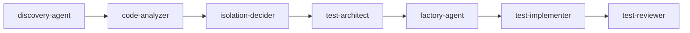
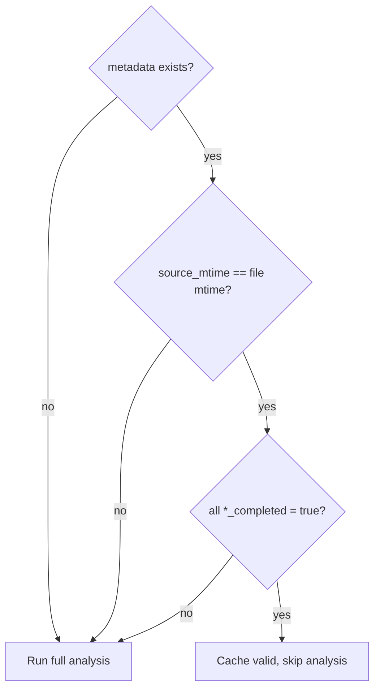
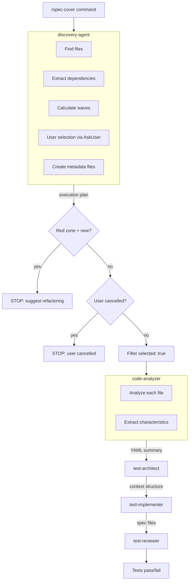

# Agent Communication Specification

Inter-agent communication patterns for rspec-testing plugin.

## Communication Mechanisms

| Scenario                    | Mechanism                     | Rationale                         |
| --------------------------- | ----------------------------- | --------------------------------- |
| Single autonomous task      | Context (prompt)              | Agent receives everything upfront |
| Parallel independent agents | Context (multiple Task calls) | No dependencies                   |
| Sequential pipeline         | Files                         | Each agent reads/writes artifacts |
| Long-running/resumable      | Files + resume                | Survives sessions                 |

## Communication Channels

### 1. Agent Response (context-based)

Every agent returns YAML in final message:

```yaml
status: success | error | skip
data:
  # agent-specific structured output
error: "message" # only if status: error
skip_reason: "message" # only if status: skip
```

### 2. Metadata Files (file-based)

**Location**: `tmp/rspec_metadata/{slug}.yml`

**Slug convention**: Source path with `/` → `_`, no extension.

- `app/services/payment.rb` → `app_services_payment`

### 3. Code Artifacts

Standard RSpec locations: `spec/**/*_spec.rb`, `spec/factories/*.rb`

---

## Pipeline Protocol

### Agent Sequence



### Sequential Execution

Agents run **one at a time, in order**. Each depends on previous output.

### Completion Markers

Each agent writes to metadata file:

```yaml
automation:
  {agent}_completed: true
  {agent}_version: "1.0"
```

Agent names use snake_case: `code_analyzer_completed`, `test_architect_completed`.

### Prerequisite Check

Before starting, each agent MUST verify:

1. Previous agent's `{agent}_completed: true` exists
2. Required input files exist

If check fails → exit with error, pipeline stops.

### Fail-Fast

If any agent fails (returns `status: error`), entire pipeline stops. No retry logic.

### Skip Scenario

Agent MAY skip work if prerequisites met but work unnecessary:

```yaml
automation:
  {agent}_completed: true
  {agent}_skipped: true
  {agent}_skip_reason: "No testable methods found"
```

Skip = success. Next agent runs.

---

## YAML Schema

### Agent Output Contract

**discovery-agent** returns:

```yaml
status: success | stop | error
reason: (if stop) red_zone_new_code | user_cancelled
message: (human-readable explanation)

# Method-level waves
method_waves:
  - wave: 0
    name: "Leaf methods"
    items:
      - method_id: "Payment#validate"
        class_name: Payment
        method_name: validate
        source_file: app/models/payment.rb
        line_range: [10, 24]
        method_mode: modified
        selected: true
        # debug-only fields (not passed downstream)
        cross_class_deps: []
        absorbed_private_methods: []

      - method_id: "Payment#charge"
        class_name: Payment
        method_name: charge
        source_file: app/models/payment.rb
        line_range: [25, 45]
        method_mode: new
        selected: true
        # debug-only fields (not passed downstream)
        cross_class_deps: []
        absorbed_private_methods: [calculate_fee]

  - wave: 1
    name: "Depends on wave 0"
    items:
      - method_id: "PaymentProcessor#process"
        class_name: PaymentProcessor
        method_name: process
        source_file: app/services/payment_processor.rb
        line_range: [10, 35]
        method_mode: modified
        selected: true
        # debug-only fields (not passed downstream)
        cross_class_deps:
          - class: Payment
        absorbed_private_methods: [validate_amount]

# File grouping (for hierarchical UI)
files:
  - path: app/models/payment.rb
    class_name: Payment
    complexity: { zone: green, loc: 85, methods: 4 }
    spec_path: spec/models/payment_spec.rb
    public_methods:
      - name: validate
        method_mode: modified
        wave: 0
        selected: true
      - name: charge
        method_mode: new
        wave: 0
        selected: true

  - path: app/services/payment_processor.rb
    class_name: PaymentProcessor
    complexity: { zone: yellow, loc: 180, methods: 8 }
    spec_path: spec/services/payment_processor_spec.rb
    public_methods:
      - name: process
        method_mode: modified
        wave: 1
        selected: true

dependency_graph:
  nodes: ["Payment#validate", "Payment#charge", "PaymentProcessor#process"]
  edges: [{ from: "PaymentProcessor#process", to: Payment }]

summary:
  total_methods: 3
  selected_methods: 3
  total_files: 2
  waves_count: 2
  by_zone: { green: 1, yellow: 1, red: 0 }
```

**Note**: discovery-agent handles **method-level** user selection via AskUserQuestion. Methods are presented hierarchically (grouped by file). User can toggle methods, filter by pattern, or provide custom instruction.

**code-analyzer** returns:

```yaml
status: success
data:
  slug: app_services_payment_processor
  source_file: app/services/payment_processor.rb
  source_mtime: 1699351530
  class_name: PaymentProcessor

  # Behavior Bank (centralized)
  behaviors:
    # Terminal behaviors
    - id: returns_completed
      description: "returns completed status"
      type: terminal
      enabled: true
      used_by: 1
    - id: returns_payment_failure
      description: "returns payment failure"
      type: terminal
      enabled: true
      used_by: 1
    - id: returns_ineligible_refund
      description: "returns ineligible for refund error"
      type: terminal
      enabled: true
      used_by: 1
    # Success behaviors (leaf values with terminal: false)
    - id: processes_payment
      description: "processes the payment"
      type: success
      enabled: true
      used_by: 1
    - id: refunds_transaction
      description: "refunds the transaction"
      type: success
      enabled: true
      used_by: 1
    # Side effect behaviors
    - id: sends_payment_notification
      description: "sends payment notification"
      type: side_effect
      subtype: webhook
      enabled: true
      used_by: 1
    - id: sends_confirmation_email
      description: "sends confirmation email"
      type: side_effect
      subtype: email
      enabled: true
      used_by: 1
    # Behaviors from external source characteristics use standard types
    - id: payment_gateway_charge_succeeds
      description: "payment gateway charge succeeds"
      type: success
      enabled: true
      used_by: 1
    - id: payment_gateway_charge_fails
      description: "payment gateway charge fails"
      type: terminal
      enabled: true
      used_by: 1

  methods:
    - name: process
      type: instance
      analyzed: true
      side_effects:
        - type: webhook
          behavior_id: sends_payment_notification
        - type: email
          behavior_id: sends_confirmation_email
      characteristics:
        - name: payment_status
          description: "payment status"
          type: enum
          values:
            - value: pending
              description: "pending payment"
              terminal: false
              # no behavior_id: continues to gateway_result
            - value: completed
              description: "completed payment"
              terminal: true
              behavior_id: returns_completed # terminal branch
            - value: failed
              description: "failed payment"
              terminal: true
              behavior_id: returns_payment_failure # terminal branch
          source_line: "15-22"
          setup:
            type: model
            class: Payment
          level: 1
          depends_on: null
          when_parent: null
        # External source characteristic (same types as internal)
        - name: gateway_result
          description: "payment gateway charge result"
          type: boolean # 2 branches = boolean
          source:
            kind: external
            class: PaymentGateway
            method: charge
          values:
            - value: true
              description: "payment gateway charge succeeds"
              behavior_id: processes_payment # leaf success flow
              terminal: false
            - value: false
              description: "payment gateway charge fails"
              behavior_id: payment_gateway_charge_fails # terminal branch
              terminal: true
          setup:
            type: action
            class: null
          level: 2
          depends_on: payment_status
          when_parent: [pending]
      dependencies: [PaymentGateway, User]

    - name: refund
      type: instance
      analyzed: true
      characteristics:
        - name: refund_eligible
          description: "refund eligibility"
          type: boolean
          values:
            - value: true
              description: "eligible for refund"
              terminal: false
              behavior_id: refunds_transaction # leaf success flow
            - value: false
              description: "not eligible"
              terminal: true
              behavior_id: returns_ineligible_refund # terminal branch
          source_line: "30"
          setup:
            type: model
            class: Transaction
          level: 1
          depends_on: null
          when_parent: null
      dependencies: [Transaction]
```

**Note**: `test_level` removed — see `open-questions.md` for build_stubbed vs create decision.
**Note**: `behaviors[]` centralizes all behavior descriptions with semantic IDs. References use `behavior_id` instead of inline text.
**Note**: Characteristics with `source.kind: external` use the same types (boolean, enum, etc.) as internal ones. The `source` object (`kind`, `class`, `method`) indicates the dependency being called. External dependencies are collapsed using flow-based analysis.

**test-architect** returns:

```yaml
status: success
spec_file: spec/services/payment_processor_spec.rb

structure:
  describe: PaymentProcessor
  methods:
    - name: "#process"
      contexts:
        - name: "when user authenticated"
          children:
            - name: "with valid payment"
              leaf: true # success flow
              examples:
                - "charges the payment"
                - "returns success result"

        - name: "when user NOT authenticated"
          terminal: true # terminal branch
          examples:
            - "denies access"

automation:
  test_architect_completed: true
  test_architect_version: "2.0"
```

**Note:** test-architect generates spec file with placeholders (`{SETUP_CODE}`, `{EXPECTATION}`). test-implementer fills these placeholders.

**test-implementer** returns:

```yaml
status: success
data:
  files_created:
    - path: spec/services/payment_processor_spec.rb
      examples_count: 8
    - path: spec/factories/payments.rb
      traits_added: [pending, completed]
```

**test-reviewer** returns:

```yaml
status: success
data:
  tests_passed: true
  violations: []
  # or
  tests_passed: false
  violations:
    - rule: 5
      description: "Missing terminal branch context"
      location: "spec/services/payment_spec.rb:45"
```

### Metadata File Schema

Full metadata file structure:

```yaml
# Written by discovery-agent
source_file: app/services/payment_processor.rb
class_name: PaymentProcessor
complexity:
  zone: green # green | yellow | red
  loc: 180
  methods: 8
spec_path: spec/services/payment_processor_spec.rb

# Method-level selection with method_mode (public metadata for downstream)
methods_to_analyze:
  - name: process
    method_mode: modified # new | modified | unchanged
    line_range: [10, 35]
    selected: true
  - name: refund
    method_mode: unchanged
    line_range: [40, 55]
    selected: false
    skip_reason: "User deselected"

# Written by code-analyzer
slug: app_services_payment_processor
source_file: app/services/payment_processor.rb
source_mtime: 1699351530 # Unix timestamp for cache validation
class_name: PaymentProcessor

# Behavior Bank (centralized)
behaviors:
  # Terminal behaviors
  - id: returns_completed
    description: "returns completed status"
    type: terminal
    enabled: true
    used_by: 1
  - id: returns_payment_failure
    description: "returns payment failure"
    type: terminal
    enabled: true
    used_by: 1
  - id: returns_ineligible_refund
    description: "returns ineligible for refund error"
    type: terminal
    enabled: true
    used_by: 1
  # Success behaviors (leaf values with terminal: false)
  - id: processes_payment
    description: "processes the payment"
    type: success
    enabled: true
    used_by: 1
  - id: refunds_transaction
    description: "refunds the transaction"
    type: success
    enabled: true
    used_by: 1
  # Side effect behaviors
  - id: sends_payment_notification
    description: "sends payment notification"
    type: side_effect
    subtype: webhook
    enabled: true
    used_by: 1
  - id: sends_confirmation_email
    description: "sends confirmation email"
    type: side_effect
    subtype: email
    enabled: true
    used_by: 1

methods:
  - name: process
    type: instance
    analyzed: true
    side_effects:
      - type: webhook
        behavior_id: sends_payment_notification
      - type: email
        behavior_id: sends_confirmation_email
    characteristics:
      - name: payment_status
        description: "payment status"
        type: enum # boolean | presence | enum | range | sequential
        values:
          - value: pending
            description: "pending payment"
            terminal: false
            behavior_id: processes_payment # leaf success flow
          - value: completed
            description: "completed"
            terminal: true
            behavior_id: returns_completed # terminal branch
          - value: failed
            description: "failed"
            terminal: true
            behavior_id: returns_payment_failure # terminal branch
        source_line: "15-22"
        setup:
          type: model # model | data | action
          class: Payment
        level: 1
        depends_on: null
        when_parent: null
    dependencies: [PaymentGateway, User]

  - name: refund
    type: instance
    analyzed: true
    characteristics:
      - name: refund_eligible
        description: "refund eligibility"
        type: boolean
        values:
          - value: true
            description: "eligible"
            terminal: false
            behavior_id: refunds_transaction # leaf success flow
          - value: false
            description: "not eligible"
            terminal: true
            behavior_id: returns_ineligible_refund # terminal branch
        source_line: "30"
        setup:
          type: model
          class: Transaction
        level: 1
        depends_on: null
        when_parent: null
    dependencies: [Transaction]

# Updated by each agent
automation:
  discovery_agent_completed: true
  discovery_agent_version: "1.0"
  code_analyzer_completed: true
  code_analyzer_version: "3.0" # bumped for behavior bank
  test_architect_completed: true
  test_architect_version: "1.0"
  test_implementer_completed: true
  test_implementer_version: "1.0"
  test_reviewer_completed: true

  errors: []
  warnings:
    - "test_implementer: Factory trait :premium not found"
```

**Note**: `test_level` and `target` fields removed. Methods are now analyzed as array with per-method characteristics.
**Note**: `behaviors[]` centralizes all behavior descriptions. All inline `behavior`/`description` fields replaced with `behavior_id` references.

---

## Progressive Enrichment

Each agent enriches metadata sequentially:

| Agent            | Writes                                                                              | Reads                                                                                    |
| ---------------- | ----------------------------------------------------------------------------------- | ---------------------------------------------------------------------------------------- |
| discovery-agent  | source_file, class_name, complexity, spec_path, `methods_to_analyze[]` (with `method_mode`) | —                                                                              |
| code-analyzer    | slug, `behaviors[]`, methods[], `*_behavior_id` references                          | source_file, class_name, complexity, `methods_to_analyze[]`                              |
| isolation-decider| `methods[].test_config` (test_level + isolation, confidence, decision_trace)        | methods[] (selected), project_type                                                       |
| test-architect   | spec_file (creates), structure (YAML)                                               | `behaviors[]`, methods[] (with `method_mode`, `test_config`), `*_behavior_id`, spec_path |
| test-implementer | automation.warnings (if any)                                                        | All metadata                                                                             |
| test-reviewer    | automation.errors (if violations)                                                   | All metadata                                                                             |

All agents update their `automation.{agent}_completed` marker.

**Note**: Method selection happens in discovery-agent. Code-analyzer uses `methods_to_analyze[].selected` to determine which methods to analyze.
**Note**: `method_mode` (new/modified/unchanged) must be present in `methods[]`; test-architect uses it to decide insert vs regenerate.
**Note**: `test_config` is added by isolation-decider (`methods[].test_config`) and used downstream for isolation/factory decisions.
**Note**: `behaviors[]` is the centralized behavior bank. All behavior references use `behavior_id` (terminal, happy path, side effects).

### Dependency Concepts Distinction

Two different dependency concepts serve different purposes:

| Field              | Agent           | Purpose                                      | Includes unchanged files?                |
| ------------------ | --------------- | -------------------------------------------- | ---------------------------------------- |
| `cross_class_deps` | discovery-agent | Wave ordering (topological sort, debug-only) | NO (filtered to changed files; internal) |
| `source.kind`      | code-analyzer   | Stub detection for testing                   | YES (all external classes)               |

**Important:** code-analyzer determines `source.kind: external` through independent analysis (any class ≠ current class), NOT by reading `cross_class_deps` from metadata. Downstream agents do not receive `cross_class_deps` (debug-only).

---

## Error Handling

### Error Response Format

```yaml
status: error
error: "Cannot determine testable methods"
details: "File has no public methods"
suggestion: "Check if class is meant to be tested"
```

### Recovery Protocol

1. Fix the issue (source code or configuration)
2. Delete or update stale metadata file
3. Re-run pipeline from failed agent

No automatic retry. Human intervention required.

---

## Cache Validation

Before re-analyzing, check if cached metadata is valid:



---

## Example: Full Pipeline Flow



**Communication channels:**

- Between agents: orchestrator passes YAML response via context
- Metadata file: persistent state for cache validation and debugging
- Waves: discovery-agent orders files so dependencies are tested first
- User selection: discovery-agent uses AskUserQuestion, supports custom instructions
