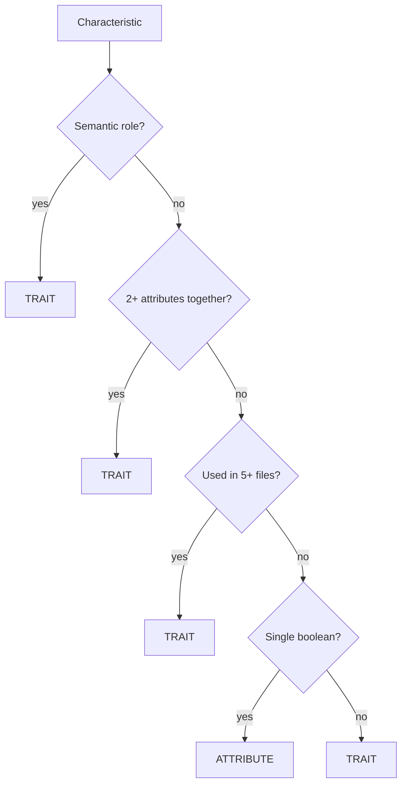
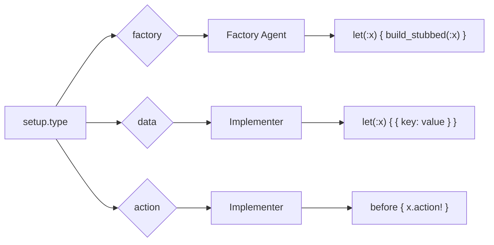
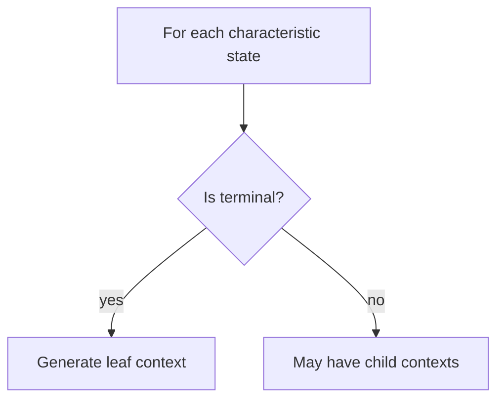

# Decision Trees

Algorithms and heuristics for agent decision-making.

---

## Context Words

RSpec context naming follows Rule 20, but the generator uses a deterministic decision tree.

### A) Context Word Selection (Generator)

Inputs:
- `level` (from metadata)
- `type` (`boolean|presence|enum|sequential|range|...`)
- `values_count`
- `state_index` (after generator ordering; `0` is the happy-path value)
- `values[].description`

Rules:
- IF `level == 1` → `when`
- IF `type in {enum, sequential}` → `and`
- IF `type == range` AND `values_count > 2` → `and`
- IF binary (`boolean`, `presence`, `range(2)`):
  - IF `state_index == 0` → `with`
  - ELSE:
    - IF `type == presence` AND description is **absence-friendly** → `without`
    - ELSE → `but`

**Absence-friendly** means the description does NOT contain (case-insensitive, word match):
`not`, `without`, `no`, `empty`, `missing`, `invalid`, `insufficient`, `blocked`, `denied`, `failed`, `error`.

### B) `NOT` Is a Modifier (Not a Context Word)

- `NOT` is part of the **description**, not the context word.
- The generator emphasizes `not` as `NOT`.
- Do not combine `without ... NOT ...`; use `but ... NOT ...` if explicit negation is required.

### C) Description Contract (code-analyzer → generator)

The generator concatenates: `"{context_word} {values[].description}"`.
So `values[].description` must be compatible with that:

- `values[].description` must NOT start with `when|with|and|but|without` (generator adds it).
- For `level >= 2` + binary types, write a noun/adjective phrase (avoid `has/have/is/are/was/were`).

---

## Factory Heuristics

Four rules for deciding trait vs attribute (priority order).

### 1. Semantic Exception (Highest Priority)

**Rule**: Always use traits for semantic roles.

**Roles list**:
```
admin, manager, supervisor, operator
authenticated, verified, confirmed, approved
blocked, suspended, banned, deleted, archived
premium, vip, pro, enterprise
active, inactive, enabled, disabled
published, draft
```

**Example**:
```ruby
# CORRECT
let(:user) { build_stubbed(:user, :admin) }

# WRONG
let(:user) { build_stubbed(:user, role: :admin) }
```

### 2. Bundling Principle

**Rule**: Use trait if 2+ attributes are set together.

**Example**:
```ruby
# Trait bundles related attributes
trait :authenticated do
  confirmed_at { Time.current }
  confirmation_token { nil }
  session_token { SecureRandom.hex }
end
```

### 3. 5-File Rule

**Rule**: Create trait if pattern used in 5+ test files.

**Detection**: grep for attribute usage across spec files.

### 4. Simplicity Default (Lowest Priority)

**Rule**: Single boolean attribute → use attribute, not trait.

**Example**:
```ruby
# Simple boolean - use attribute
let(:user) { build_stubbed(:user, active: false) }

# NOT a trait for single boolean
```

### Decision Flow



---

## Setup Type Selection

Which agent handles which setup type.



### When to Use Each

| Condition | Setup Type |
|-----------|------------|
| ActiveRecord model | `factory` |
| Plain Ruby object (PORO) | `data` |
| Hash/primitive value | `data` |
| State machine transition | `action` |
| Session/authentication | `action` |
| External service call | `action` |

---

## Terminal States

States that should not have child contexts.

### Detection

Terminal if:
1. Business logic stops (e.g., `not_authenticated`)
2. Final state in sequence (e.g., `completed`, `cancelled`)
3. Error/rejection state (e.g., `insufficient_balance`)

### Generator Behavior



---

## Scope Rules

How many methods to cover per file.

| Methods in File | Action |
|-----------------|--------|
| 1-5 | Cover all automatically |
| 6-10 | Ask user: all/selected/one |
| >10 | Suggest refactoring, ask user |

### Rationale

- 1-5: Common case, no decision needed
- 6-10: User might want partial coverage
- >10: Code smell, likely needs splitting

---

## Test Level Selection

Handled by **isolation-decider** agent. It writes `methods[].test_config` (test_level + isolation, confidence, decision_trace) based on heuristics and optional user input. Downstream agents read `test_config`; they do not infer levels themselves. See `agents/isolation-decider.md` for details.

---

## Complexity Zones

Code complexity affects test generation approach. **Discovery-agent** determines the zone.

| Zone | LOC | Methods | Action |
|------|-----|---------|--------|
| Green | <150 | <7 | Proceed normally |
| Yellow | 150-300 | 7-12 | Warning, proceed |
| Red | >300 | >12 | STOP, suggest refactoring |

### STOP Condition

For **new code** in Red Zone:
1. discovery-agent returns `status: stop`
2. Displays refactoring suggestions
3. Does not proceed to code-analyzer

For **legacy code**: Yellow Zone allowed, Red Zone warns but proceeds.
