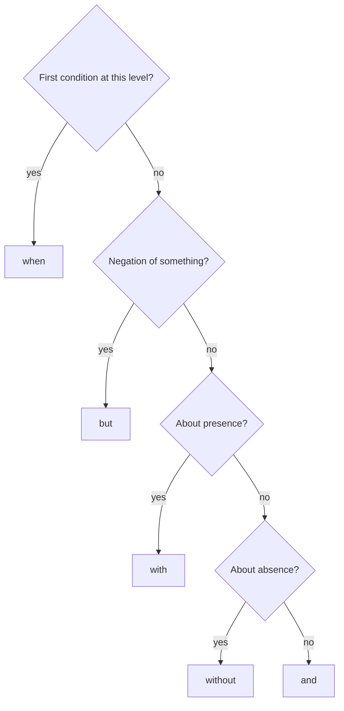
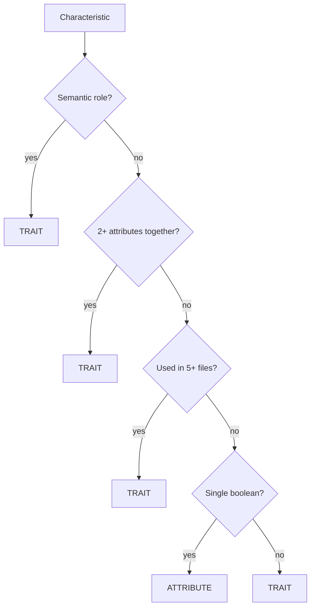
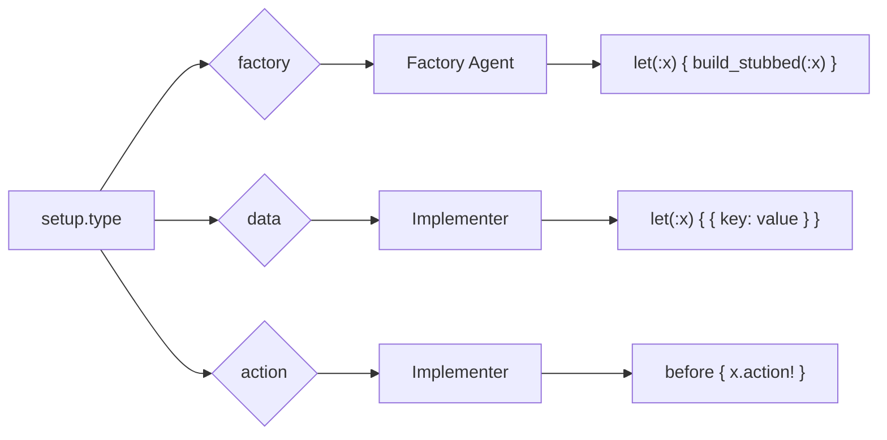
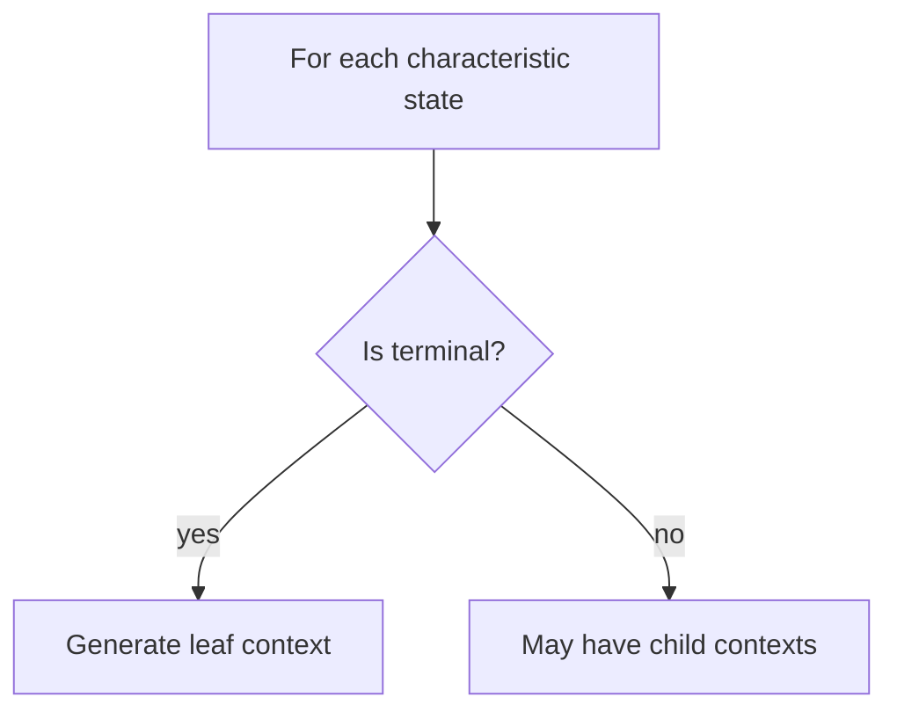
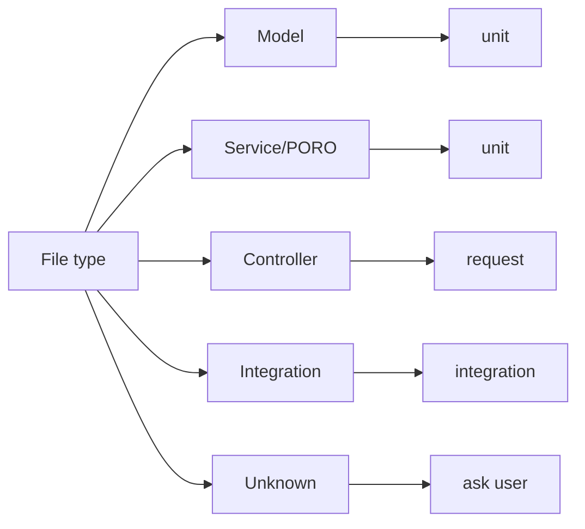

# Decision Trees

Algorithms and heuristics for agent decision-making.

---

## Context Words

RSpec context naming follows specific rules (Rule 20 from guide).

| Position | Word | Example |
|----------|------|---------|
| First condition | `when` | `when user authenticated` |
| Additional same-level | `and` | `and has premium status` |
| Negation | `but` | `but email not confirmed` |
| Presence | `with` | `with valid payment method` |
| Absence | `without` | `without admin privileges` |

### Selection Algorithm



---

## Factory Heuristics

Four rules for deciding trait vs attribute (priority order).

### 1. Semantic Exception (Highest Priority)

**Rule**: Always use traits for semantic roles.

**Roles list**:
```
admin, manager, supervisor, operator
authenticated, verified, confirmed, approved
blocked, suspended, banned, deleted, archived
premium, vip, pro, enterprise
active, inactive, enabled, disabled
published, draft
```

**Example**:
```ruby
# CORRECT
let(:user) { build_stubbed(:user, :admin) }

# WRONG
let(:user) { build_stubbed(:user, role: :admin) }
```

### 2. Bundling Principle

**Rule**: Use trait if 2+ attributes are set together.

**Example**:
```ruby
# Trait bundles related attributes
trait :authenticated do
  confirmed_at { Time.current }
  confirmation_token { nil }
  session_token { SecureRandom.hex }
end
```

### 3. 5-File Rule

**Rule**: Create trait if pattern used in 5+ test files.

**Detection**: grep for attribute usage across spec files.

### 4. Simplicity Default (Lowest Priority)

**Rule**: Single boolean attribute → use attribute, not trait.

**Example**:
```ruby
# Simple boolean - use attribute
let(:user) { build_stubbed(:user, active: false) }

# NOT a trait for single boolean
```

### Decision Flow



---

## Setup Type Selection

Which agent handles which setup type.



### When to Use Each

| Condition | Setup Type |
|-----------|------------|
| ActiveRecord model | `factory` |
| Plain Ruby object (PORO) | `data` |
| Hash/primitive value | `data` |
| State machine transition | `action` |
| Session/authentication | `action` |
| External service call | `action` |

---

## Terminal States

States that should not have child contexts.

### Detection

Terminal if:
1. Business logic stops (e.g., `not_authenticated`)
2. Final state in sequence (e.g., `completed`, `cancelled`)
3. Error/rejection state (e.g., `insufficient_balance`)

### Architect Behavior



---

## Scope Rules

How many methods to cover per file.

| Methods in File | Action |
|-----------------|--------|
| 1-5 | Cover all automatically |
| 6-10 | Ask user: all/selected/one |
| >10 | Suggest refactoring, ask user |

### Rationale

- 1-5: Common case, no decision needed
- 6-10: User might want partial coverage
- >10: Code smell, likely needs splitting

---

## Test Level Selection



### Impact on Factory Calls

| Test Level | Factory Method | Reason |
|------------|---------------|--------|
| unit | `build_stubbed` | No database |
| integration | `create` | Need persistence |
| request | `create` | Full stack |

---

## Complexity Zones

Code complexity affects test generation approach. **Discovery-agent** determines the zone.

| Zone | LOC | Methods | Action |
|------|-----|---------|--------|
| Green | <150 | <7 | Proceed normally |
| Yellow | 150-300 | 7-12 | Warning, proceed |
| Red | >300 | >12 | STOP, suggest refactoring |

### STOP Condition

For **new code** in Red Zone:
1. discovery-agent returns `status: stop`
2. Displays refactoring suggestions
3. Does not proceed to code-analyzer

For **legacy code**: Yellow Zone allowed, Red Zone warns but proceeds.
